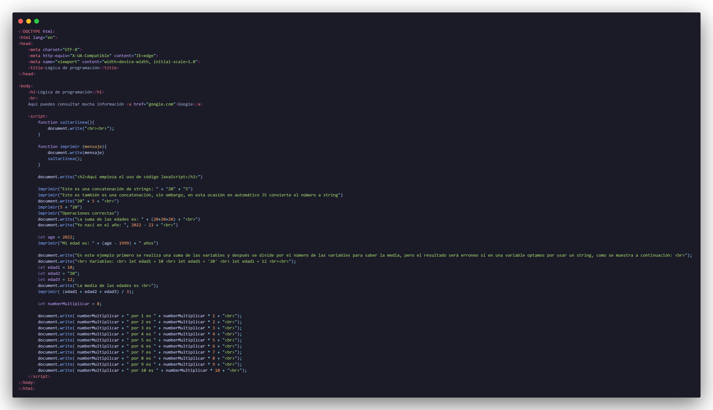

# Lógica de programación parte 1: Primeros pasos

Para este curso se utilizó el lenguaje de programación JavaScript para comprender el uso de variables, para realizar ciertas funciones, operaciones que JavaScript puede realizar de manera dinámica y también con HTML para hacer toda la parte de formatación.

## Descripción de los ejercicios realizados

**01-empezandoJS.html**



En este primer archivo se vieron bastantes cosas, tales como diferencia el código HTML con JavaScript, la creación de funciones con y sin parámetros, llamar una función dentro de otra función, entre otras cosas.

Para empezar, para hacer uso de HTML se debe de hacer uso de etiquetas, por ejemplo, en el archivo se presenta lo siguiente:
```
<h1>Lógica de programación</h1>
<br>
Aquí puedes consultar mucha información <a href="google.com">Google</a>
```

Que es código HTML, lo que se puede visualizar al abrir el navegador y es estático. En cambio, todo lo de JavaScript esta encerrado por la siguiente etiqueta:
```
<script> </script>
```

Como se mencionó anteriorment, JavaScript nos permité realizar diferentes cosas, por ejemplo, declarar variables:
```
let age = 2022;
```

Otra de las cosas que se vio fue el como usar código HTML dentro de JavaScript, esto se consigue con la siguiente sintaxis:
```
document.write("etiqueta")
```

***Nota impotante: El sitio MDN Web Docs (que es una plataforma de aprendizaje para las tecnologías web) recomienda no utilizar este método, sin embargo, para este parte se utilizará en forma de aprendizaje y que no afecta.***

En el archivo se utilizó más para imprimir mensajes y hacer uso de la etiqueta `<br>` para hacer saltos de líneas, e incluso se creo una función denominada "saltarLinea" para este fin, como se muestra a continuación:
```
function saltarlinea(){
    document.write("<br><br><br>");
}
```

Así mismo se implemento otra función con el fin que fuera más fácil de mostrar los mensajes en el HTML, la función que se creo se denomina "imprimir":
```
function imprimir (mensaje){
    document.write(mensaje)
    saltarlinea();
}
```

Otra de las cosas más importantes es que dentro de las funciones se pueden llamar otras funciones, solo es cuestión de poner el nombre de la función y los paréntesis.

También se vio que puede haber concatenación de strings así como una concatenación de un string y un número ya que en automático JS lo hace. Si en dado caso queremos realizar una operación debemos de verificar que todos sean de tipo de number para que se pueda realizar.

Por último, en este ejercicio se vio la utilidad de usar variables y de la misma forma, podemos realizar operaciones usando variables y una de sus ventajas es que si en algún momento se optá por cambiar el contenido de la variable es que se realiza desde un solo lugar al contrario que haríamos sino usáramos variables. Un claro ejemplo es con una tabla de multiplicación, como se muestra en el código, se realiza la tabla del 8, pero si en dado caso quisiéramos saber la tabla de otro número solo bastaría con cambiar el contenido de la variable "numberMultiplicar".

## ¿Que se aprendió a lo largo de este curso?
* Conceptos básicos de HTML: Lenguaje de etiquetas.
* Diferenciar HTML de JavaScript.
* Concatenar caracteres (strings).
* Operaciones conjuntas entres textos y números.
* Usar variables para reducir código.
* Diferentes tipos de datos en las variables y fórmulas.
* Crear funciones y usar funciones con parámetros.
* Produndizar en el retorno de funciones.